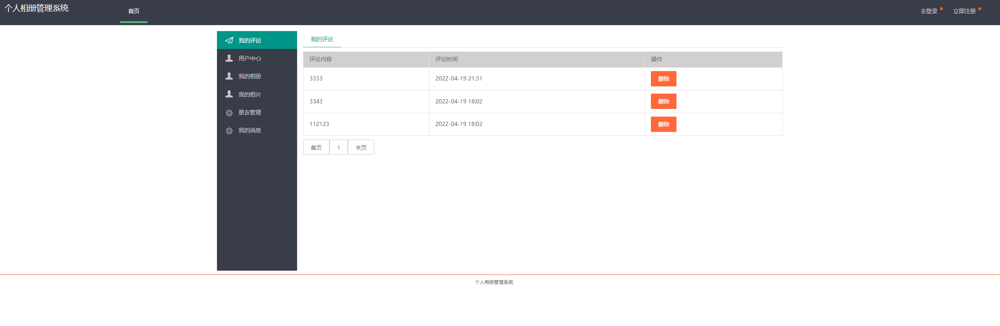
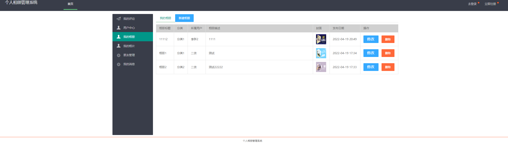
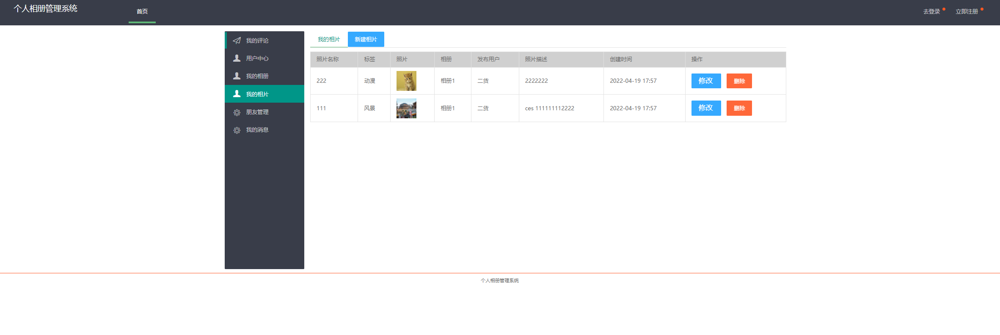

## 基于SSM框架的个人相册系统(程序+报告)

###  获取sql数据库文件: 从戎源码网 (https://armycodes.com/) QQ: 386869957 QQ群: 377586148
###  所有系统地址: (https://github.com/YuLin-Coder/AllProjectCatalog) 
###  所有项目以及源代码本人均调试运行无问题 可支持远程安装部署调试、定制修改、代码讲解

## 项目介绍
基于SSM框架的个人相册系统，分为前台和后台，有用户和管理员两个角色，主要功能如下

前台模块：
1. 展示相片信息：用户可以浏览自己上传的相片并查看相片的详细信息。
2. 下载相片：用户可以下载自己或其他用户共享的相片到本地设备。
3. 个人信息：用户可以编辑和管理自己的个人信息，包括头像、昵称、个人简介等。
4. 朋友圈管理：用户可以发布和管理自己的朋友圈动态，包括文字、相片、视频等。
5. 我的评论：用户可以查看自己在他人相片或朋友圈的评论，也可以回复或删除评论。
6. 发消息：用户可以与好友进行消息的发送和接收，实现私聊功能。

后台模块：
1. 个人信息维护：用户可以查看和编辑自己的个人信息，包括头像、昵称、个人简介等。
2. 用户管理：管理员可以对用户进行管理，包括添加新用户、编辑用户信息、冻结用户账号等。
3. 相册类别管理：管理员可以管理相册的分类信息，包括添加新分类、编辑分类名称、删除分类等。
4. 标签管理：管理员可以管理相片的标签信息，包括添加标签、编辑标签名称、删除标签等。
5. 相片管理：管理员可以管理相片的信息，包括上传新相片、编辑相片信息、删除相片等。
6. 评论管理：管理员可以查看和管理用户的评论，包括审核评论、删除评论等。
7. 消息管理：管理员可以查看用户之间的消息记录，也可以进行消息的删除和管理。
8. 朋友管理：管理员可以管理用户的好友关系，包括添加好友、删除好友等功能。

## 项目技术
- 编程语言：Java
- 数据库：MySQL
- 前端技术：JSP、JavaScript、Jquery、Layui
- 后端技术：Spring、SpringMVC、MyBatis

## 运行环境
- JDK版本：JDK1.8及以上
- 开发工具：IDEA、Ecplise、Myecplise都可以
- 数据库: MySQL5.7及以上
- Maven：maven3.0及以上

## 运行截图

